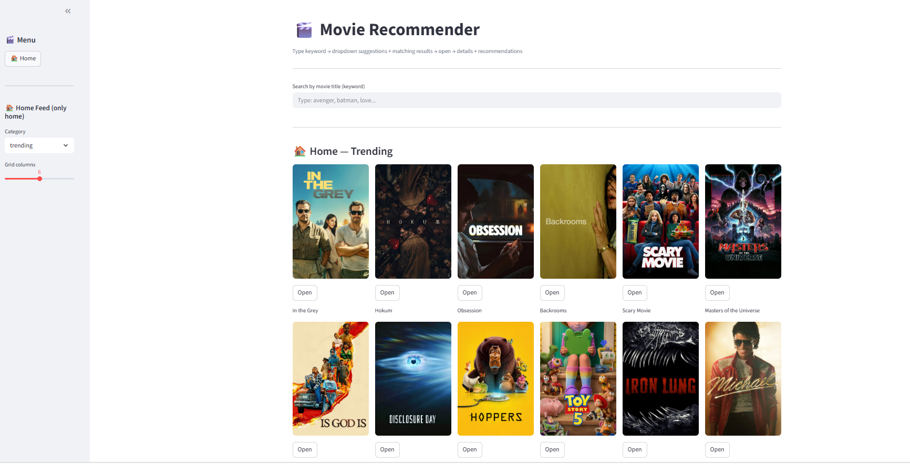

# 🎬 Movie Recommendation System

A Machine Learning-based Movie Recommendation System that suggests similar movies based on user selection. The application uses movie metadata and content-based filtering techniques to generate personalized recommendations and fetches movie posters using the TMDB API.

## 📸 Application Screenshot




🚀 Live Demo

🔗 Try the App:
https://movie-recommendation-qtvowyd5fqz6kgnlqspnxr.streamlit.app/


## 🚀 Features

* Movie recommendations based on similarity
* TMDB API integration for movie posters
* Interactive Streamlit user interface
* Fast and user-friendly experience
* Machine Learning-powered recommendation engine

## 🛠️ Technologies Used

* Python
* Pandas
* NumPy
* Scikit-learn
* Streamlit
* TMDB API
* Pickle

## 📂 Project Structure

movie-recommendation/

├── app.py

└── movie_recommendation.ipynb

├── movies.pkl

├── similarity.pkl

├── requirements.txt

├── README.md

└── images/

    └── app_screenshot.png

## ⚙️ Installation

1. Clone the repository

```bash
git clone https://github.com/your-username/movie-recommendation.git
```

2. Navigate to the project directory

```bash
cd movie-recommendation
```

3. Install dependencies

```bash
pip install -r requirements.txt
```

4. Run the application

```bash
streamlit run app.py
```

## 🌐 Live Demo

Streamlit App: Add your Streamlit URL here

## 📊 Machine Learning Approach

The recommendation engine uses Content-Based Filtering and Cosine Similarity to find movies similar to the selected movie based on movie metadata and features.

## 🎯 Future Improvements

* User authentication
* Collaborative filtering
* Hybrid recommendation system
* Advanced search and filtering
* Personalized recommendations
* 
## 👨‍💻 Author

**Talha Abbasi**

📧 Email: [talhaabbaci543@gmail.com](mailto:talhaabbaci543@gmail.com)

🐙 GitHub: [TalhaAbbasi-543](https://github.com/TalhaAbbasi-543)

